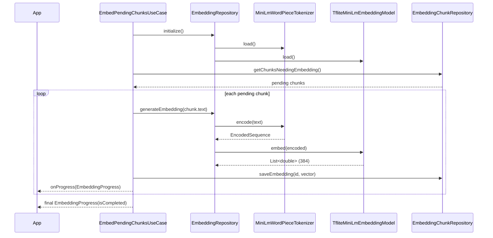
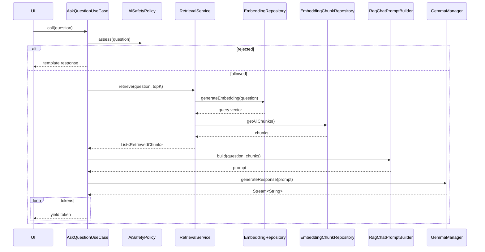

# ExpenseFlow — AI Architecture

This document describes the on-device AI stack of ExpenseFlow: chunk
generation, embeddings, retrieval, the Gemma chat pipeline, and AI safety.

> Status note: the two model backends are scaffolded but not yet fully wired.
> MiniLM embedding inference currently throws `UnimplementedError` (the
> `.tflite`/`vocab.txt` assets are not bundled yet), and Gemma needs an
> inference engine package plus a model URL. The architecture, contracts, and
> tests are complete; only the final inference plumbing and assets are
> pending.

---

## 1. Architecture

The AI feature lives under `lib/features/ai/` and follows the project-wide
**feature-first clean architecture**:

```
┌─────────────────────────────────────────────────────────────┐
│  Presentation  screens · widgets · Bloc/Cubit                │
├─────────────────────────────────────────────────────────────┤
│  Domain        entities · repository contracts · use cases   │
│                pure services (retrieval, chat, safety)       │
├─────────────────────────────────────────────────────────────┤
│  Data          Hive models · datasources · repository impls  │
│                TFLite / flutter_gemma wrappers               │
└─────────────────────────────────────────────────────────────┘
```

Dependencies point **inward**: `data → domain`, `presentation → domain`.
The domain layer has no Flutter, Hive, or TFLite imports.

### Dependency inversion in practice

| Domain abstraction | Data implementation |
|---|---|
| `EmbeddingRepository` | `EmbeddingRepositoryImpl` |
| `EmbeddingChunkRepository` | `EmbeddingChunkRepositoryImpl` |
| `EmbeddingModel` | `TfliteMiniLmEmbeddingModel` |
| `EmbeddingTokenizer` | `MiniLmWordPieceTokenizer` |
| `GemmaManager` | `GemmaManagerImpl` |
| `AiDisclaimerRepository` | `AiDisclaimerRepositoryImpl` |
| `AiSafetyPolicy` | `RuleBasedAiSafetyPolicy` |

Everything is wired through **get_it** (`lib/core/di/injection_container.dart`).
Repositories, data sources, use cases, and services are singletons; Blocs are
factories.

### Two independent backends

1. **Embedding backend** — TensorFlow Lite (`tflite_flutter`) running a
   MiniLM sentence-embedding model. Produces dense vectors for text.
2. **Generation backend** — Gemma (`flutter_gemma`) running an on-device
   chat LLM. Produces token streams.

The retrieval pipeline only needs the embedding backend. The chat pipeline
needs both.

---

## 2. Folder structure

```
lib/features/ai/
├── domain/
│   ├── entities/
│   │   ├── embedding_chunk.dart            # chunk + vector + needsEmbedding flag
│   │   ├── embedding_progress.dart         # pipeline run snapshot
│   │   ├── encoded_sequence.dart           # token ids / masks for inference
│   │   ├── retrieved_chunk.dart            # chunk + cosine similarity score
│   │   ├── chunk_inputs.dart               # neutral DTOs for generators
│   │   ├── unsafe_topic.dart               # forbidden advice topics
│   │   └── safety_verdict.dart             # allowed | rejected(+template)
│   ├── repositories/
│   │   ├── embedding_repository.dart       # text → vector contract
│   │   ├── embedding_chunk_repository.dart # chunk CRUD + embedding flags
│   │   └── ai_disclaimer_repository.dart   # one-time disclaimer flag
│   ├── services/
│   │   ├── chunk_generators/               # text summaries for each entity
│   │   ├── embedding/                      # model, tokenizer, singleton facade
│   │   ├── retrieval/                      # cosine similarity, top-k, service
│   │   ├── chat/                           # prompt builder contract + RAG impl
│   │   ├── gemma/                          # GemmaManager contract
│   │   └── safety/                         # AI safety policy + rule-based impl
│   └── usecases/
│       ├── regenerate_transaction_chunks_usecase.dart
│       ├── embed_pending_chunks_usecase.dart
│       ├── generate_embedding_usecase.dart
│       ├── embed_query_usecase.dart
│       ├── ask_question_usecase.dart       # end-to-end RAG chat pipeline
│       ├── should_show_disclaimer_usecase.dart
│       └── acknowledge_disclaimer_usecase.dart
├── data/
│   ├── models/
│   │   ├── embedding_chunk_model.dart      # Hive model (@HiveType, id 3)
│   │   └── minilm/
│   │       ├── minilm_model_config.dart    # paths, dims, special tokens
│   │       ├── minilm_word_piece_tokenizer.dart
│   │       └── tflite_minilm_embedding_model.dart  # Interpreter wrapper
│   ├── gemma/
│   │   ├── gemma_model_config.dart         # model type, file type, max tokens
│   │   └── gemma_manager_impl.dart         # FlutterGemma facade
│   ├── datasources/local/
│   │   ├── embedding_chunk_local_datasource(_impl).dart   # Hive box
│   │   └── embedding_model_datasource(_impl).dart         # asset loader
│   └── repositories/
│       ├── embedding_repository_impl.dart
│       ├── embedding_chunk_repository_impl.dart
│       └── ai_disclaimer_repository_impl.dart
└── presentation/
    └── screens/
        └── ai_disclaimer_screen.dart       # one-time first-launch disclaimer

assets/models/minilm/        # model.tflite + vocab.txt (to be added)
test/features/ai/            # unit tests (mocktail mocks for Hive & TFLite)
```

---

## 3. Class responsibilities

### Domain — entities

| Class | Responsibility |
|---|---|
| `EmbeddingChunk` | A persisted text chunk (`text`), its dense `embedding`, `chunkType` discriminator, `sourceId`, timestamps, and the `needsEmbedding` flag. |
| `EmbeddingProgress` | Snapshot (`total/processed/succeeded/failed`) of one embedding run, emitted via callback. |
| `EncodedSequence` | Token ids + attention mask (+ segment ids) prepared for the model. |
| `RetrievedChunk` | An `EmbeddingChunk` paired with its similarity score. |
| `ChunkInput` family | Neutral DTOs (`TransactionChunkInput`, `MonthlySummaryChunkInput`, …) decoupling generators from other features. |
| `UnsafeTopic` | Enum of forbidden advice topics (investment, tax, loan, medical). |
| `SafetyVerdict` | `allowed` or `rejected(topic, template)` outcome of safety evaluation. |

### Domain — services

| Class | Responsibility |
|---|---|
| `ChunkGenerator<T>` | Interface: one generator per entity → a natural-language summary string + stable `chunkType`. |
| `Transaction/Monthly/Weekly/Category/Budget/SavingsGoal/SubscriptionChunkGenerator` | Format specific summaries (pure functions). |
| `ChunkTextFormatter` | INR currency / date formatting shared by generators. |
| `EmbeddingModel` | Contract: `load()`, `embed(EncodedSequence) → List<double>`, `embeddingSize`, `maxSequenceLength`. |
| `EmbeddingTokenizer` | Contract: `load()`, `encode(String) → EncodedSequence`, `vocabSize`, `maxTokens`. |
| `EmbeddingService` | App-wide singleton facade over `EmbeddingRepository`; single entry point for producing vectors. |
| `TopKRetriever` | Scores chunks with cosine similarity; `scoreAll()` (pure) + `retrieve()` (loads + truncates to `topK`). |
| `RetrievalService` | End-to-end retrieval: embed query → load chunks → score → recency tie-break → dedup → top `k`. |
| `ChatPromptBuilder` | Contract for composing a prompt from question + retrieved chunks. |
| `RagChatPromptBuilder` | Default builder: system instruction + capped context + question + answer marker. |
| `GemmaManager` | Contract: `initialize`, `downloadModel`, `isModelDownloaded`, `generateResponse → Stream<String>`, `dispose`. |
| `AiSafetyPolicy` | Contract: `assess(question) → SafetyVerdict`. |
| `RuleBasedAiSafetyPolicy` | Keyword-based guard that rejects the four forbidden topics with canned templates. |

### Domain — repositories & use cases

| Class | Responsibility |
|---|---|
| `EmbeddingRepository` | Contract for lifecycle (`initialize`, `isLoaded`) and `text → vector`. |
| `EmbeddingChunkRepository` | Contract for chunk persistence + `getChunksNeedingEmbedding`, `saveEmbedding`, `clearEmbeddings`. |
| `AiDisclaimerRepository` | Contract for the one-time disclaimer flag. |
| `RegenerateTransactionChunksUseCase` | Rebuilds the transaction chunk (+ monthly/weekly/category summaries) on a transaction change; deletes the chunk when the transaction is removed. |
| `EmbedPendingChunksUseCase` | Drains all `needsEmbedding` chunks through the embedding pipeline; per-chunk failures are recorded and retried later. |
| `GenerateEmbeddingUseCase` | One-off text → vector (mirrors `EmbeddingService`). |
| `EmbedQueryUseCase` | Generates the query embedding for a user question. |
| `AskQuestionUseCase` | The RAG chat pipeline: safety → retrieve → prompt → Gemma stream. |
| `ShouldShowDisclaimerUseCase` | `true` only before the disclaimer is acknowledged once. |
| `AcknowledgeDisclaimerUseCase` | Persists the disclaimer acknowledgement. |

### Data — implementations

| Class | Responsibility |
|---|---|
| `EmbeddingChunkLocalDataSourceImpl` | Hive box CRUD keyed by chunk id; sorts by `createdAt`; implements `saveEmbedding`/`clearEmbeddings` semantics. |
| `EmbeddingChunkRepositoryImpl` | Maps `EmbeddingChunk ⇄ EmbeddingChunkModel`. |
| `EmbeddingRepositoryImpl` | Orchestrates tokenizer + model: lazy init, encode, embed. |
| `AssetEmbeddingModelDataSource` | Loads `model.tflite` / `vocab.txt` via `rootBundle`. |
| `MiniLmWordPieceTokenizer` | Full WordPiece tokenizer with padding to `maxSequenceLength`. |
| `TfliteMiniLmEmbeddingModel` | Loads the `Interpreter` from bytes; `embed()` is a pending placeholder. |
| `GemmaManagerImpl` | Wraps `FlutterGemma`: install model from URL, check install, create chat, stream `TextResponse` tokens, dispose. |
| `AiDisclaimerRepositoryImpl` | Persists `has_seen_disclaimer` in the `ai_disclaimer_box` Hive box. |

### Presentation

| Class | Responsibility |
|---|---|
| `AiDisclaimerScreen` | One-time disclaimer shown on first launch; acknowledges via `AcknowledgeDisclaimerUseCase`, then routes to onboarding. |

---

## 4. Data flow

### 4.1 Indexing flow (writing)

```
Transaction / Budget / Goal / Subscription changes
        │
        ▼
RegenerateTransactionChunksUseCase / RefreshSummariesUseCase
        │  (Caller maps feature entities → ChunkInput DTOs)
        ▼
ChunkGenerators ──► EmbeddingChunk(text, chunkType, sourceId,
                        needsEmbedding = true)
        │
        ▼
EmbeddingChunkRepository.saveChunk ──► Hive box (ai_embeddings_box)
        │
        ▼
EmbedPendingChunksUseCase (background pass)
        │  for each needsEmbedding chunk:
        ▼
EmbeddingRepository.generateEmbedding(text)
        │  tokenize (WordPiece) → model inference → vector
        ▼
EmbeddingChunkRepository.saveEmbedding(id, vector)
        │  (needsEmbedding → false)
        ▼
        chunk is searchable
```

### 4.2 Query flow (reading)

```
User question
        │
        ▼
AskQuestionUseCase
        ├─ AiSafetyPolicy.assess() ── rejected? ──► yield template response
        ▼
RetrievalService.retrieve(question)
        │  1. EmbeddingRepository.generateEmbedding(question)
        │  2. EmbeddingChunkRepository.getAllChunks()
        │  3. TopKRetriever.scoreAll()  (cosine similarity)
        │  4. sort (similarity desc, createdAt desc as tie-break)
        │  5. dedup by (chunkType | sourceId)
        │  6. top k (default 8)
        ▼
List<RetrievedChunk>
        │
        ▼
RagChatPromptBuilder.build(question, chunks) → prompt
        │
        ▼
GemmaManager.generateResponse(prompt) → Stream<String> (token by token)
        │
        ▼
final answer = concatenated tokens
```

---

## 5. Sequence diagram

### 5.1 Embedding a pending chunk



### 5.2 Answering a question



---

## 6. How embeddings work

1. **Input** — a normalised plain-text chunk or query.
2. **Tokenization** — `MiniLmWordPieceTokenizer` (config in
   `MiniLmModelConfig`, matching `sentence-transformers/all-MiniLM-L6-v2`):
   - Vocabulary from `assets/models/minilm/vocab.txt`.
   - Text → sub-word tokens via WordPiece.
   - Special tokens added: `[CLS]` … `[SEP]`, unknown → `[UNK]`.
   - Fixed length `maxSequenceLength = 128` (pad → `[PAD]`).
   - Output is an `EncodedSequence` (`inputIds`, `attentionMask`, `tokenTypeIds`).
3. **Inference** — `TfliteMiniLmEmbeddingModel`:
   - Loads the graph bytes from `assets/models/minilm/model.tflite` and
     builds a `tflite_flutter` `Interpreter` (`Interpreter.fromBuffer`, sync).
   - The forward pass (`embed()`) is a **placeholder** that throws
     `UnimplementedError` until the model asset + tensor plumbing are added.
4. **Output** — a dense vector of `embeddingSize = 384` floats.

The pipeline is fronted by `EmbeddingService` (singleton facade) and
`EmbeddingRepository`, which hides tokenizer/model/asset details and performs
lazy, idempotent initialisation.

> Amounts are tracked in INR; the text payloads are pure strings, so no
> currency conversion happens inside embeddings.

---

## 7. How retrieval works

### Cosine similarity

`cosineSimilarity(a, b)` (`domain/services/retrieval/cosine_similarity.dart`):

```
            a · b
  sim = ─────────────────
         ‖a‖ · ‖b‖        (range [-1, 1])
```

- Throws `ArgumentError` when vectors differ in length.
- Returns `0.0` when either vector is empty or has zero magnitude.

### Top-k scoring

`TopKRetriever`:
- `scoreAll(query, chunks, minScore)` — pure: drops chunks with no embedding,
  computes similarity, filters `< minScore`, sorts descending.
- `retrieve(queryEmbedding, topK, minScore)` — loads chunks from the repo,
  scores, truncates to `topK`. Validates `topK ≥ 1` and `minScore ∈ [-1, 1]`.

### End-to-end `RetrievalService.retrieve()`

1. Embed the query (`EmbeddingRepository`).
2. Load every stored chunk (`EmbeddingChunkRepository.getAllChunks`).
3. Score all with cosine similarity.
4. Sort by similarity (desc), **ties broken by recency** (`createdAt` desc).
5. **Deduplicate** by `chunkType | sourceId` (a source entity may produce
   several chunks; only the best-ranked one is kept).
6. Return up to `topK` (default **8**).

This is a brute-force linear scan — acceptable at this data scale; see
Performance considerations.

---

## 8. How Gemma works

`GemmaManagerImpl` wraps the `flutter_gemma` plugin behind the `GemmaManager`
contract. Configuration lives in `GemmaModelConfig`
(`ModelType.gemmaIt`, `ModelFileType.task`, `maxTokens = 1024`).

Lifecycle:

1. **Initialize** — `FlutterGemma.initialize()` once; preloads the active
   model if one is already installed.
2. **Download** — `downloadModel(url, onProgress)` uses the fluent
   `installModel(...).fromNetwork(url).withProgress(...).install()` API.
   `isModelDownloaded(modelId)` maps to `FlutterGemma.isModelInstalled`.
3. **Stream** — `generateResponse(prompt)`:
   - `FlutterGemma.getActiveModel(maxTokens)` → `InferenceModel`
   - `model.createChat()` → `InferenceChat`
   - `chat.addQueryChunk(Message.text(text: prompt, isUser: true))`
   - stream `chat.generateChatResponseAsync()`, mapping each `ModelResponse`
     to the token text when it is a `TextResponse`.
4. **Dispose** — closes the model and resets the runtime.

`GemmaManager` never builds prompts (that is `ChatPromptBuilder`'s job) — it
only takes a ready prompt and returns tokens.

> Requires an engine package (e.g. `flutter_gemma_mediapipe` for `.task`/
> `.bin`, or `flutter_gemma_litertlm` for `.litertlm`) and a model URL. The
> core package is a dependency already (`flutter_gemma: ^1.5.2`).

### AI safety (gate before Gemma)

`RuleBasedAiSafetyPolicy` rejects investment, tax, loan, and medical advice
via case-insensitive keyword matching and returns a canned template response.
`AskQuestionUseCase` checks this **before** retrieval/Gemma, so unsafe
questions never touch the expensive pipeline.

### One-time disclaimer

On first launch `SplashScreen` checks `ShouldShowDisclaimerUseCase`; if not
acknowledged it routes to `AiDisclaimerScreen` (`/ai-disclaimer`).
Acknowledging calls `AcknowledgeDisclaimerUseCase`, which persists
`has_seen_disclaimer` in the `ai_disclaimer_box` Hive box, then continues to
onboarding. Shown only once ever.

---

## 9. Performance considerations

**What is already fast:**

- **Lazy, idempotent init** — model + tokenizer load once (`EmbeddingRepository.initialize` guards `_isLoaded`); `EmbeddingService` is a singleton.
- **Streaming** — Gemma tokens are streamed (`async*`), so the UI can render
  progressively instead of blocking on a full generation.
- **Pure domain services** — generators, cosine similarity, and ranking are
  sync pure functions; trivially fast and testable.
- **Fixed token budget** — `maxSequenceLength = 128` and a capped prompt
  context (`RagChatPromptBuilder.maxContextLength = 6000`) bound model input.
- **Background work** — chunk regeneration and summary refresh run off the UI
  path (`BackgroundSummaryRefreshService`).
- **No GC pressure in the hot loop** — `cosineSimilarity` allocates nothing
  per comparison (single pass, no intermediate lists).

**Known costs / watch items:**

- **Brute-force retrieval** — `scoreAll` is O(n · d) over all chunks
  (d = 384). Fine for hundreds/thousands of chunks; degrade above ~10k chunks.
- **Cold-start cost** — first `generateEmbedding` triggers model load; on
  low-end devices this can take a second or two. Pre-warm at a good moment
  (e.g. after the disclaimer/splash).
- **RAM/VRAM for Gemma** — on-device LLMs are memory hungry; a fallback
  strategy (RAM gating → rule-based template answers) is planned.
- **Hive reads** — `getAllChunks()` materialises the whole box per query;
  acceptable today, revisit with pagination or an in-memory index.
- **Float precision** — vectors stored as `List<double>` in Hive; consider
  quantized `Float32List`/`Uint8` for large stores.

---

## 10. Future improvements

- **Wire MiniLM inference** — bundle `model.tflite` + `vocab.txt`, implement
  `TfliteMiniLmEmbeddingModel.embed()` (input/output tensor plumbing,
  mean pooling / CLS pooling, optional INT8 quantization).
- **Wire Gemma engine** — add an inference engine package
  (`flutter_gemma_mediapipe` or `flutter_gemma_litertlm`) and a model URL;
  add a settings UI for download progress.
- **RAM-based fallback (Strategy Pattern)** — `AnswerStrategy` with a
  `GemmaAnswerStrategy` and a `TemplateAnswerStrategy`; a `DeviceCapability`
  (via `device_info_plus`, threshold ~3 GB) auto-selects the strategy.
  `device_info_plus` is already a dependency.
- **Vector index** — replace brute-force with an HNSW/IVF index or an
  in-memory precomputed `Float32List` matrix for sub-ms retrieval at scale.
- **Chunk-level embedding invalidation** — version chunks so edits mark only
  the affected vectors stale instead of blanket `clearEmbeddings`.
- **Reranking** — after top-k, rerank with a cross-encoder or let Gemma pick
  relevant context to cut prompt size.
- **Hybrid retrieval** — combine dense (embedding) with sparse/keyword (BM25)
  signals for queries that embeddings miss.
- **Scheduled embedding refresh** — move `EmbedPendingChunksUseCase` behind a
  `workmanager`/`background_fetch` schedule instead of only launch-time.
- **Localization** — move template responses and disclaimer copy into ARB
  (`AppLocalizations`).
- **Observability** — latency/throughput metrics per pipeline stage; log
  retrieval recall on user feedback.

---

## Appendix — Key references

| Concern | File |
|---|---|
| Pipeline entry point | `lib/features/ai/domain/usecases/ask_question_usecase.dart` |
| Indexing trigger | `lib/features/expense/domain/usecases/summary_refresh/*.dart` |
| Background refresh | `lib/core/background/background_summary_refresh_service.dart` |
| DI registration | `lib/core/di/injection_container.dart` |
| First-launch gate | `lib/features/splash/presentation/screens/splash_screen.dart` |
| Routes | `lib/core/router/app_router.dart` |
| Tests | `test/features/ai/` (88 passing; mocktail mocks for Hive & TFLite) |
